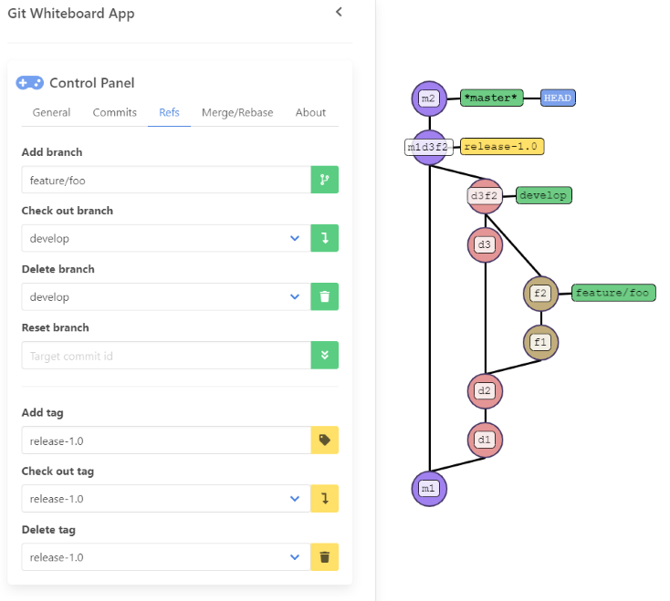

# Git Whiteboard App

The Git Whiteboard App is a web application that allows you to quickly and easily create Git graphs in your browser for demonstration purposes. The application is designed to provide all the visual possibilities that are usually required on a whiteboard to draw Git graphs: Commit graphs, HEAD, branch and tag labels, simplified commit IDs, separate graphs for local and remote repositories to demonstrate push and pull, etc. The handling must be quick and easy, so that during a Git training course, for example, you can create a simple demo Git graph with a few mouse clicks to explain a specific Git concept. The Git Whiteboard App's goal is to eliminate the need to use a whiteboard or flipchart to draw Git Graphs during a training session or lecture.

This is the app in action. It shows a simple demo Git history which can be used to explain and demonstrate a number of Git features:



This project was first developed as part of the two We-Ship-It-Days at the [Mannheim offices of Trivadis Germany GmbH](https://www.oio.de/).

## Try it out

You can try out the pre-built version of the Git Whiteboard App in directory `/try-it-out`. Just open the `index.html` file in your browser.

## How to build and run

To build the app, run the following command on the console:

```
./gradlew run
```

Then visit `http://localhost:9090` in your browser. You need to have a JDK installed for this. 

## Motivation
One problem that arises with any Git training is that when explaining Git functionality, it is relatively cumbersome for the trainer to adequately illustrate the dynamics of a Git history as it evolves. To date, a trainer has only the following three tools to visually demonstrate the creation of a Git History. Each of these three has its own specific drawbacks:

* Creation of a Git Graph across multiple PowerPoint slides: only depict a simple and predefined scenario. Offers no possibility to vary or extend a scenario.

* Demonstrating the creation of a Git history on the command line with Git commands: this is cumbersome, because in order to achieve certain steps (e.g., create some sample commits), you must perform many manual steps that are irrelevant to the example (e.g., make local changes several times, invent a commit message, perform a commit).

* Drawing on the whiteboard or flipchart: In order to be able to display the dynamics of a Git history, you must constantly wipe away parts of the drawings on the whiteboard and redraw them, which is not possible on a flipchart. When you move the HEAD pointer and branch labels, you quickly reach the limits of what is possible. Some trainers help themselves with small pieces of paper on which the branch names are written, and adhesive tape. Furthermore, space is limited; especially flipcharts are unsuitable for Git history graphs.
  
The Git Whiteboard App is supposed to offer another flexible alternative. With this web application, it must be at least as easy to visualize a Git history as on a whiteboard. But in contrast to drawing on the whiteboard, dynamically changing the history should be much easier. For example, it should be possible to move a branch pointer anywhere in the Git graph, as with Git reset. Also, functions like Git rebase should be easier to display visually than on the whiteboard.